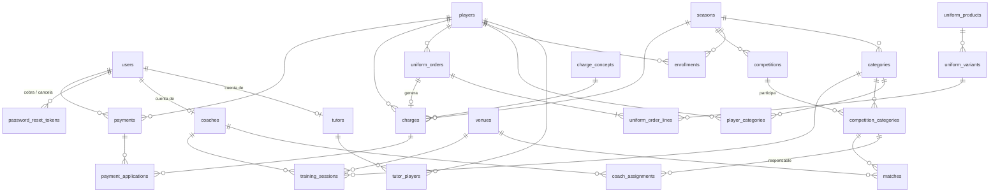

# Relaciones, en lenguaje sencillo

## Personas y cuentas

- Un **usuario** es alguien que puede iniciar sesión. Su `role` decide qué puede hacer; los permisos por rol están en
  el código (`core/auth/permissions.ts`), no en la BD.
- Un **tutor** y un **entrenador** son personas del dominio. Pueden tener cuenta de usuario o no: por ejemplo, un
  papá que nunca entra al portal. Si la tienen, `tutors.user_id` o `coaches.user_id` apuntan a ella, y la BD exige
  que esa cuenta tenga el rol correcto.
- Un **jugador** puede tener varios tutores y un tutor varios jugadores (`tutor_players`). Cada vínculo dice el
  parentesco y si ese tutor es el contacto principal del jugador; como máximo hay uno principal.

## Temporada, inscripción y categoría (¡dos cosas distintas!)

- **Inscripción** (`enrollments`): «Diego está inscrito administrativamente en la temporada 2026-2027». No dice nada de
  categoría. Sólo puede haber una activa por jugador y temporada. Las mensualidades se generan para los jugadores
  activos inscritos en la temporada activa.
- **Categoría** (`player_categories`): «Diego juega en Sub-10 desde el 5 de agosto». La fila sin `end_date` es la
  categoría actual, y sólo puede haber una. Para cambiarlo de categoría se cierra la fila actual (se le pone
  `end_date`) y se abre otra: así queda el historial.
- Cada categoría pertenece a una temporada. Por eso la pertenencia no necesita guardar la temporada.

## Competencias y agenda

- Una **competencia** (torneo o liga) pertenece a una temporada.
- Una **participación** (`competition_categories`) dice «Sub-10 juega la Liga Municipal». Eso es lo que decide en qué
  torneos está una categoría, tenga o no entrenador asignado.
- Una **asignación** (`coach_assignments`) dice «Carlos es el responsable de Sub-10 en la Liga Municipal». Sólo se
  puede asignar entrenador a una participación ya registrada. La BD impide mezclar temporadas distintas.
- Un **partido** también exige que la categoría participe en esa competencia.
- La **agenda** son los **partidos** (de una competencia y categoría, en una sede) más los **entrenamientos** (de una
  categoría, con entrenador y sede). No hay tabla de agenda: se consulta uniendo ambas.

## Cobranza

```text
Jugador ──< Cargo >──┐
   │                 │   Un pago puede pagar varios cargos y un cargo recibir varios pagos.
   └──< Pago >──< Aplicación >
```

- Un **cargo** es algo que se debe: la mensualidad de septiembre, la inscripción, un uniforme.
- Un **pago** es dinero recibido, con folio de recibo, método y quién lo cobró.
- Una **aplicación** dice cuánto de un pago se usó para un cargo. La BD impide aplicar el pago de un jugador al cargo
  de otro.
- **Saldo de un cargo** = monto del cargo − lo aplicado por pagos **no cancelados**. Nunca se guarda; se consulta en la
  vista `charge_balances`, que también da el estado: pagado, parcial, pendiente o vencido.
- Un pago **nunca se borra**: se cancela, con fecha, quién y motivo. Sus aplicaciones se quedan para el historial,
  pero dejan de contar, y el cargo vuelve a deber.

## Uniformes

```text
Producto ──< Variante (talla, precio actual) ──< Línea de pedido >── Pedido ── Cargo (1 por pedido)
                                                  (cantidad, precio histórico, entrega)
```

- Al pedir, el precio se **copia** a la línea. Si luego sube el precio del producto, el pedido no cambia.
- El pedido genera **un cargo** en cobranza, del mismo jugador, y se paga como cualquier cargo.
- La entrega se registra **por línea** (cuándo, quién entregó y a quién). Un pedido está entregado cuando todas sus
  líneas lo están.

## Portal del tutor (consulta segura)

```text
usuario autenticado → tutors.user_id → tutor_players → players → (categoría actual → participaciones, cargos, uniformes)
```

El backend **siempre** parte del usuario del token. Nunca confía en un `playerId` enviado por el navegador: si llega
uno, debe comprobar que esté en `tutor_players` de ese tutor.

## Diagrama ER


